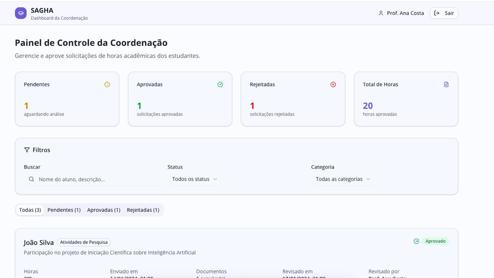
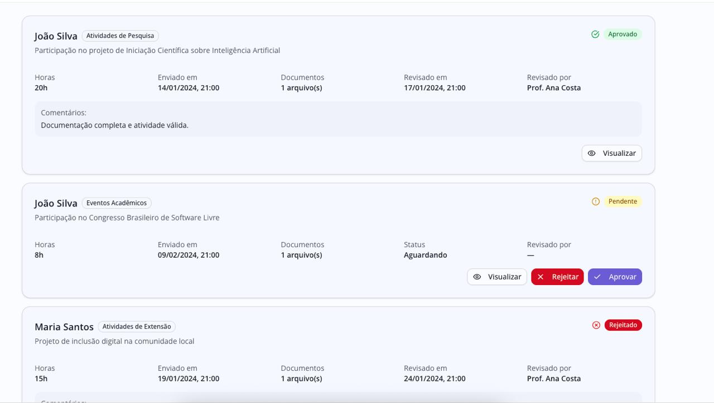
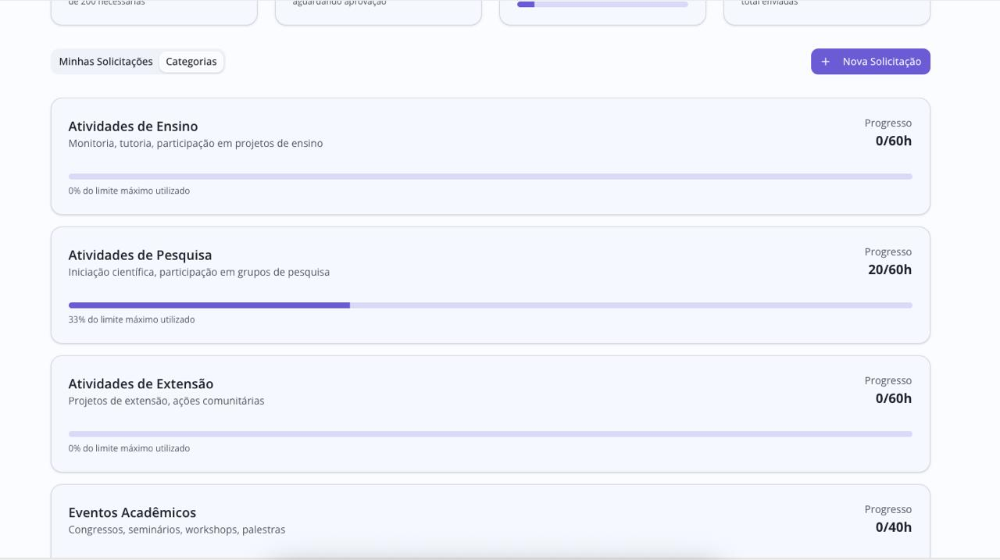
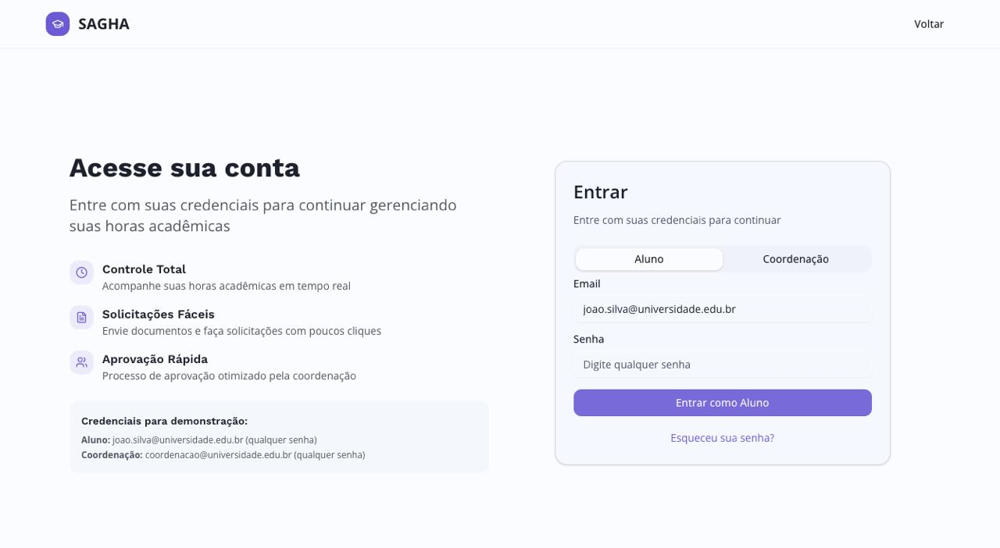
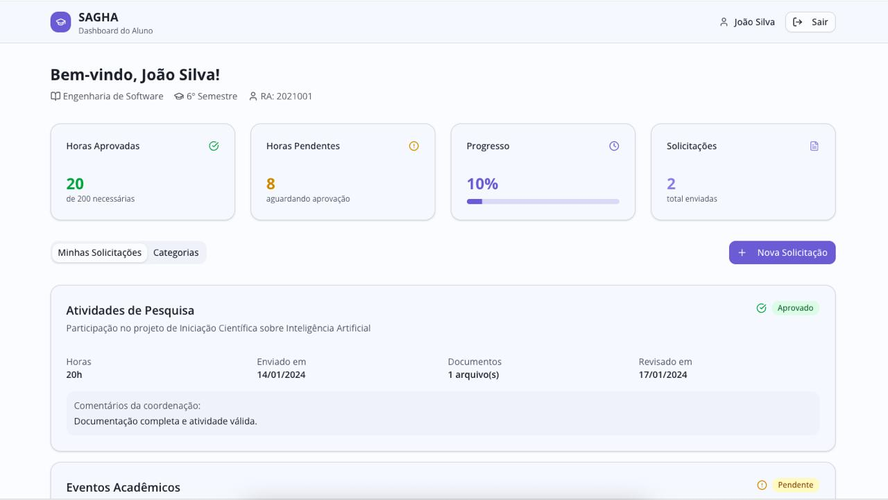
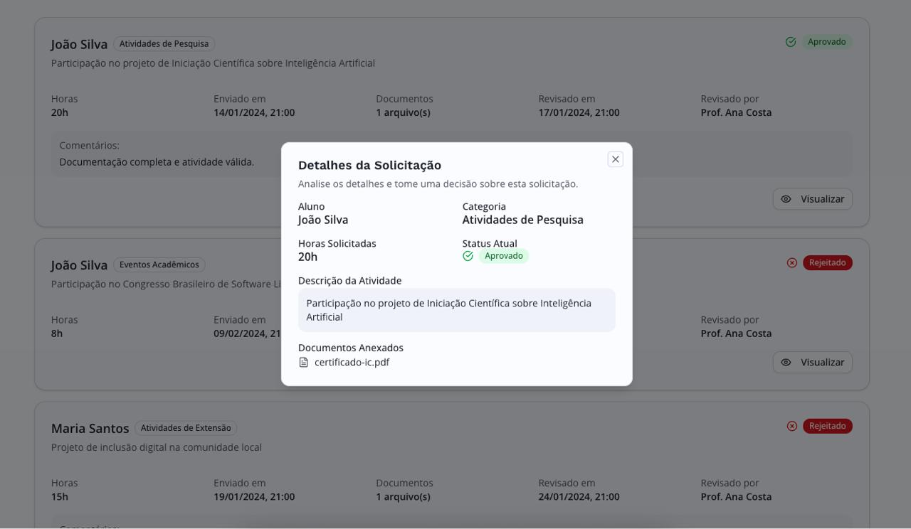

# SAGHA - Sistema de Acompanhamento e Gestão de Horas Acadêmicas

## Descrição do Projeto
O SAGHA é uma aplicação web desenvolvida para facilitar o acompanhamento e a gestão de horas acadêmicas.

## Ferramentas Utilizadas

### Backend
- [Node.js](https://nodejs.org/): Ambiente de execução JavaScript no lado do servidor.  
- [TypeScript](https://www.typescriptlang.org/): Superset do JavaScript que adiciona tipagem estática para maior segurança no desenvolvimento.  
- [Fastify](https://fastify.dev/): Framework web rápido e otimizado para criação de APIs.  
- [Zod](https://zod.dev/): Biblioteca de validação e tipagem de dados.  
- [Swagger](https://swagger.io/): Ferramenta para documentação e teste de APIs.  
- [Prisma ORM](https://www.prisma.io/): ORM moderno para interação com bancos de dados.  
- [Cloudinary](https://cloudinary.com/): Serviço de gerenciamento e hospedagem de imagens e vídeos.  

### Frontend
- [React](https://react.dev/): Biblioteca JavaScript para construção de interfaces de usuário.  
- [TypeScript](https://www.typescriptlang.org/): Usado também no frontend para garantir maior robustez e escalabilidade.  
- [TailwindCSS](https://tailwindcss.com/): Framework CSS utilitário para estilização rápida e customizável.  
- [Shadcn/UI](https://ui.shadcn.com/): Conjunto de componentes de interface acessíveis e personalizáveis.  
- [Zod](https://zod.dev/): Usado também no frontend para validação de formulários e dados.  
- [Ky](https://github.com/sindresorhus/ky): Cliente HTTP baseado em `fetch` para requisições simples e modernas.  

## Arquitetura do Sistema
A arquitetura do **SAGHA** é baseada em uma aplicação web composta por três camadas principais: **frontend**, **API/backend** e **banco de dados**, além de um serviço externo para armazenamento de arquivos.


### 1. Frontend (React)
- Responsável pela interface com o usuário.  
- Envia **requisições HTTP** para a API e recebe as **respostas HTTP** com dados processados.  
- Constrói a experiência de uso do sistema de forma dinâmica e interativa.  

### 2. API (Fastify)
- Funciona como camada intermediária entre o frontend e os demais serviços.  
- Recebe as requisições do React, processa a lógica de negócio e retorna as respostas.  
- Utiliza **Prisma ORM** para se comunicar com o banco de dados.  
- Integra-se com o **Cloudinary** para enviar e recuperar arquivos (como imagens e documentos).  

### 3. Banco de Dados (PostgreSQL)
- Armazena todas as informações persistentes do sistema (ex.: usuários, horas acadêmicas, registros de atividades).  
- É acessado exclusivamente pela API por meio do **Prisma ORM**, que facilita consultas, inserções e atualizações de forma tipada e segura.  

### 4. Cloudinary
- Serviço externo para **armazenamento e gerenciamento de arquivos** (como imagens de comprovantes ou documentos).  
- A API envia os arquivos para o Cloudinary, que retorna uma **URL pública**.  
- Essa URL é então utilizada pelo frontend para exibir os arquivos diretamente na interface do usuário.  

## Protótipos de Alta Fidelidade
<p align="center">
  
  
  
  
  
  
  
  
</p>

## Rodando o Projeto Localmente

### 1. Downloads Necessários
- [Git](https://git-scm.com/downloads): Sistema de controle de versão para clonar e gerenciar o repositório.  
- [Node.js e NPM](https://nodejs.org/en/download): Ambiente de execução JavaScript e gerenciador de pacotes necessários para instalar dependências.  
- [Docker](https://www.docker.com/get-started): Plataforma para criar e executar containers que facilitam a configuração do ambiente.


### 2. Clonando o Repositório
```bash
git clone https://github.com/arthurmousinho/SAGHA.git
```

### 3. Rodando o Backend
- Navegue até a pasta do backend pelo terminal:
```bash
cd backend
```

- Crie um arquivo `.env` baseado no `.env.example`, preenchendo as variáveis conforme necessário:
```bash
cp .env.example .env
```

- Rode o banco de dados usando o Docker:
```bash
docker compose up -d
```

- Instale as dependência:
```bash
npm install
```

- Rode o projeto:
```bash
npm run dev
```

## Padrão de Commits

Adotamos o padrão **Conventional Commits** para manter o histórico de commits claro e consistente.  
Cada mensagem deve começar com um tipo, opcionalmente um escopo, seguido por uma descrição breve.

### Tipos mais comuns
- **feat**: Introduz uma nova funcionalidade.  
- **fix**: Corrige um bug.  
- **docs**: Alterações apenas na documentação.  
- **style**: Mudanças de estilo (formatação, indentação, ponto e vírgula, etc. – sem alterar lógica).  
- **refactor**: Alteração de código que não corrige bug nem adiciona funcionalidade.  
- **perf**: Melhoria de performance.  
- **test**: Adição ou modificação de testes.  
- **chore**: Tarefas de manutenção, ajustes de build ou ferramentas auxiliares.  

### Exemplos
```bash
git commit -m "feat(auth): add JWT authentication"
git commit -m "fix(ui): fix button alignment issue"
git commit -m "docs(readme): update installation instructions"
git commit -m "chore(deps): update dependencies"
```

Seguindo este padrão é possível automatizar changelogs, versionamento semântico e melhorar a colaboração no projeto.